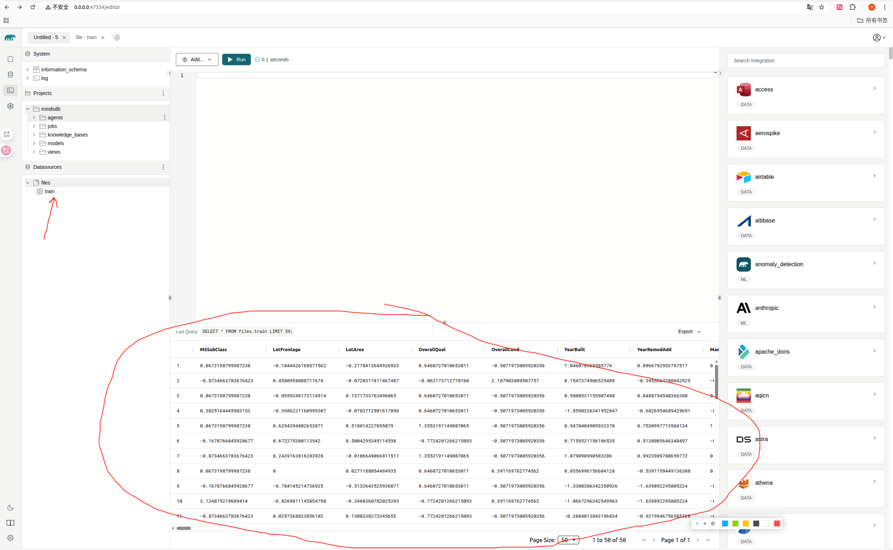

# MindsDB 技术调研报告MindsDB 技术调研报告
- [1. 概述](#1-概述)
- [2.核心功能](#2核心功能)
  - [2.1 AI 表](#21-ai-表-ai-tables)
  - [2.2 与数据源的广泛集成](#22-与数据源的广泛集成)
  - [2.3 对多种AI/ML框架的支持](#23-对多种aiml框架的支持)
  - [2.4 自动化机器学习](#24-自动化机器学习-automl)
  - [2.5 SQL驱动的AI工作流](#25-sql驱动的ai工作流)
- [3.环境搭建](#3环境搭建)
  - [3.1 Docker部署](#31-docker部署)
  - [3.2 pip安装](#32-使用pip安装)
  - [3.3 云服务](#33-mindsdb-cloud)
- [4.应用示例](#4下面我们用一个小项目来应用mindsdb)

## 1. 概述
MindsDB是一个开源的**AI中间件**，它将机器学习模型无缝集成到现有数据库系统中，使用户能够通过**标准的SQL查询**来构建、训练、部署和利用机器学习模型。它旨在降低机器学习的应用门槛，让开发者和数据分析师无需深入了解复杂的机器学习算法，即可在其数据环境中获得强大的预测分析能力。

MindsDB的**核心理念**是将 AI模型抽象为数据库中的虚拟表，即“AI 表”（AI Tables）。用户可以通过操作这些AI表，像查询普通数据一样，来获取模型的预测结果，从而极大地简化了在应用程序中集成 AI 功能的流程。

该平台由Adam Carrigan 和 Jorge Torres 于2017年创立，并获得了包括 Benchmark、Mayfield、Nvidia 在内的知名机构的投资。作为一个快速发展的开源项目，MindsDB在GitHub上获得了大量的关注和社区贡献，并支持超过130个平台集成，涵盖了从数据源到 AI 框架的广泛生态。你可以点击[这里](https://github.com/mindsdb/mindsdb)前往MindsDB的github仓库

## 2.核心功能
MindsDB的强大之处在于其有多个丰富而实用的功能，这些功能共同构成了一个连接数据与AI的强大枢纽。
### 2.1 AI 表 (AI Tables)
这是 MindsDB 最具创新性的核心技术。AI 表是一种虚拟表，它封装了机器学习模型。开发者可以通过简单的 SQL SELECT 语句查询这些表，并传入需要预测的数据，AI 表便会返回模型的预测结果。这种方式使得在应用程序中调用 AI 模型变得像查询数据库一样简单，无需复杂的 API调用和数据传输。


>下面我会举个例子对比一下两者的区别：

假设我们的场景如下

**用AI预测房屋售价** 
| anzahl_zimmer | anzahl_badezimmer | flaeche | preis |
|---|---|---|---|
| 3 | 2 | 1500 | 300000 |
| 4 | 3 | 2200 | 450000 |
| 2 | 1 | 900 | 180000 |
| ... | ... | ... | ... |

#### 传统方法是这样做的


**1.模型训练(假设是Python 环境，使用Scikit-learn)**

用相关库来训练模型
```python
import pandas as pd
from sklearn.model_selection import train_test_split
from sklearn.ensemble import RandomForestRegressor
import joblib

# 加载数据
# (我们需要从数据库连接并用SQL语句加载数据到pandas DataFrame)
df = pd.read_sql("SELECT * FROM home_rentals", db_connection)

# 准备数据
X = df[['anzahl_zimmer', 'anzahl_badezimmer', 'flaeche']]
y = df['preis']
X_train, X_test, y_train, y_test = train_test_split(X, y, test_size=0.2)

# 训练模型
model = RandomForestRegressor()
model.fit(X_train, y_train)

# 保存模型以备部署
joblib.dump(model, 'house_price_model.pkl')
```

**2.模型部署 (后端开发)**

后端工程师需要将保存的模型文件 (.pkl) 包装成一个API，例如用 Flask或FastAPI这样的Web框架。
```python
# app.py - 使用 Flask
from flask import Flask, request, jsonify
import joblib

app = Flask(__name__)

# 加载训练好的模型
model = joblib.load('house_price_model.pkl')

@app.route('/predict', methods=['POST'])
def predict():
    # 获取请求数据
    data = request.get_json()
    features = [data['anzahl_zimmer'], data['anzahl_badezimmer'], data['flaeche']]
    prediction = model.predict([features])
    # 返回结果
    return jsonify({'predicted_price': prediction[0]})
if __name__ == '__main__':
    app.run(debug=True, port=5000)
```

**3.应用集成(前端调用)**

应用程序需要向部署好的API发起HTTP请求来获取预测结果。
```python
import requests
# 准备需要预测的新数据
new_house_data = {
    'anzahl_zimmer': 3,
    'anzahl_badezimmer': 2,
    'flaeche': 1600
}

# 按规则调用API
response = requests.post('http://localhost:5000/predict', json=new_house_data)

# 解析结果
predicted_price = response.json()['predicted_price']
print(f"预测价格: {predicted_price}")
```

#### 使用MindsDB是这样的


**1.数据库内模型训练**

只需要一条 CREATE MODEL 语句，MindsDB 就会自动连接数据源、选择合适的模型、训练并完成部署。
```SQL
CREATE MODEL mindsdb.house_price_model
FROM postgres_db.home_rentals -- 指定数据源和表
PREDICT preis; -- 指定要预测的目标列
```

**2.获取预测结果**
模型训练完成后，MindsDB 会自动创建一个名为 house_price_model 的 "AI 表"。你可以像查询普通数据库表一样，用一条 SELECT 语句来获取预测结果。
```SQL
SELECT preis AS predicted_price
FROM mindsdb.house_price_model
WHERE anzahl_zimmer = 3
  AND anzahl_badezimmer = 2
  AND flaeche = 1600;
```

### 2.2 与数据源的广泛集成
>MindsDB 能够连接并查询多种数据源，包括但不限于：

- 关系型数据库: 如 MySQL, PostgreSQL, MariaDB等

- 数据仓库: 如 Google BigQuery, Snowflake, Amazon Redshift等
- NoSQL 数据库：如MongoDB

- 应用程序和文件格式: 支持直接从应用程序（如Intercom）和文件（如 CSV）中获取数据

这种兼容不同查询引擎的能力使得用户可以在不移动数据的情况下，对来自不同来源的数据进行统一的 AI 操作

### 2.3 对多种AI/ML框架的支持
>MindsDB 不仅仅局限于内置的 AutoML 功能，它还集成了业界流行的 AI 和机器学习框架，包括：
- PyTorch
- OpenAI (GPT-3, GPT-4)
- HuggingFace
- LangChain

这使得开发者可以根据自己的需求，灵活选择和部署从经典的机器学习模型到先进的生成式 AI 模型

### 2.4 自动化机器学习 (AutoML)
MindsDB 内置了强大的 AutoML 功能，能够自动化数据预处理、特征工程、模型选择和训练等一系列繁琐的步骤。
这极大地降低了机器学习的门槛，~~方便学生党水毕设课设~~

即使是非专业人士也能够构建出高性能的预测模型。

>(但是如果你真的想要训练出效果较好的模型，还是建议你自己写预处理逻辑)

### 2.5 SQL驱动的AI工作流
用户可以使用熟悉的 SQL 语句来完成整个AI工作流，包括：
- CREATE DATABASE: 连接到一个新的数据源。
- CREATE ML_ENGINE: 注册一个新的机器学习引擎（如 OpenAI）。
- CREATE MODEL: 使用指定的引擎和数据来训练一个新的模型。
- SELECT: 从训练好的模型（AI表）中获取预测结果。

## 3.环境搭建
MindsDB提供了多种灵活的安装和部署方式，方便快速开始

### 3.1 Docker部署
执行以下命令即可启动MindsDB：
```bash
sudo docker run -p 47334:47334 -p 47335:47335 mindsdb/mindsdb
```
启动后，可以通过浏览器访问 http://127.0.0.1:47334 来使用 MindsDB的图形化界面编辑器。如下图:

### 3.2 使用pip安装
```bash
python -m venv mindsdb_env
source mindsdb_env/bin/activate
pip install mindsdb
```
>注意:确保你使用的是 Python 3.8 或更高版本。

### 3.3 MindsDB Cloud
MindsDB 官方提供了云服务，这是一个完全托管的解决方案，用户无需关心部署和维护，可以直接注册并开始使用。这对于希望快速上手和用于生产环境的用户来说是一个非常方便的选择。

## 4.下面我们用一个小项目来应用MindsDB

我们准备通过Kaggle的一个竞赛项目将这些知识付诸实践。房价预测竞赛是一个很好的起点。数据相当通用，没有表现出可能需要专门模型的奇特结构（例如音频或视频）。

>该数据集由 De Cock( 2011 )收集，涵盖了 2006 年至 2010 年期间爱荷华州艾姆斯的房价。它比其他的住房数据集要大得多 ，拥有更多的示例和特征。

更多详情可以跳转这里（https://www.kaggle.com/c/house-prices-advanced-regression-techniques）

1.下载数据集

你可以从[这里](http://d2l-data.s3-accelerate.amazonaws.com/kaggle_house_pred_train.csv)下载数据集，是一个csv格式的文件。当然为了方便大家实践，数据集我已经上传到这个仓库了，名字为kaggle_house_pred_train.csv

2.自定义预处理操作

MindsDB默认会进行常规的预处理操作，如残缺数据补齐，NULL值处理，特殊字符转换等。正常来说你可以直接把数据集读入MindsDB并开始工作。但是我强烈建议自定义数据预处理部分，这样你的模型会更加准确。详情可见preprocess.py
你可以
```bash
pip install torch torchvision pandas
python preprocess.py
```
他会对数据集进行特征标准化，对部分分类进行独热编码，结果会单独保存为train_preprocessed.csv

3.安装并打开MindsDB

这里以docker为例,请确保你安装了nvidia-docker。（必须要支持nvidia,因为涉及到深度学习相关的操作）
```
sudo docker run -p 47334:47334 -p 47335:47335 mindsdb/mindsdb --name mindsdb
```
上述指令会创建一个名为mindsdb的docker容器，使用的是官方提供的mindsdb/mindsdb镜像，并且进行了对应的端口映射

>解释一下，mindsdb/mindsdb是MindsDB官方提供的基础镜像，仅包含MindsDB相关的组件。任何机器学习的库都要自己安装。它使用container里的全局python环境，你可以直接在其中操作。

第一次运行上述指令会拉取镜像，并弹出一大堆INFO输出。成功启动之后，再浏览器输入http://0.0.0.0:47334/editor 即可进入MindsDB操作界面

还没完，就像上面说的，我们还需要给容器额外安装所需要的深度学习组件。

新开一个终端进程，输入下面的指令
```
sudo docker ps -a
sudo docker exec -it <你的容器ID> bash
pip install lightwood
```
第二行要填入你查看到的ID。

正常情况下会进行安装依赖，有很多的库，大改要等二十几分钟。因为源是国外的访问起来比较慢，建议开个代理会快很多。

4.导入数据

打开浏览器http://0.0.0.0:47334/editor ，会出现下面这个界面：

之后你就可以使用MindsDB的CLI进行操作，就像使用数据库一样。
首先导入训练数据，因为我们是从file读取，需要手动上传。点击upload file

然后选择你的文件夹，选中刚才预处理好的文件train_preprocessed.csv
,填入重新命名的新名字（例如这里使用train）

成功之后你点击左边这个train就可以查看导入的数据


5.训练和试运行

我们可以用类似SQL语句的方式快速开始训练和测试。点击界面上的小三角即可运行你选中的语句。

（跟市面上任何一款数据库的CLI一样，每次只能运行你选中的语句）


```
CREATE DATABASE local_kaggle_data
WITH ENGINE = 'files';
```
>这会创建一个新的数据库，名为local_kaggle_data，数据引擎是file，表示我们的数据是文件类型的。
这意味着你可以像操作任何数据库那样使用SELECT,DELETE,DROP等方法操作里面的数据


```
CREATE MODEL mindsdb.kaggle_house_price_predictor
FROM local_kaggle_data (SELECT * FROM train)
PREDICT SalePrice;
```
>这会创建一个AI table，名为kaggle_house_price_predictor，它指定了用于训练的数据源是local_kaggle_data，读取了其中名为train的表格里的所有数据用于训练，需要预测的column是SalePrice。当你运行上面这些，MindsDB就会自动选取合适的模型进行训练。

------------------------------------
随后当模型训练好，你就可以直接像查询数据库那样使用模型预测数据，就好比现场查询数据。
```
SELECT price AS predicted_price
FROM mindsdb.rental_price_predictor
WHERE number_of_rooms = 3
  AND number_of_bathrooms = 2
  AND sqft = 1500;
```
>如果你之前的操作都没有问题，这里就会显示预测金额。
把这里的定值连接后端API，他就是一个方便我们操作的数据库风格的AI。（当然MindsDB本质上是一个数据库中间件）

至此，该项目已经成功！


